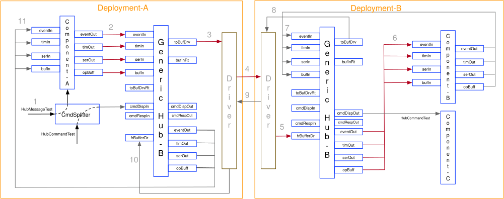

# Project Setup

This guide will walk through the steps of setting up the reference deployment.

<!-- TODO: UPDATE REPO NAME -->
## 1. Clone the GitHub repository
Clone the GitHub repository onto your local machine.
```sh
git clone https://github.com/fprime-community/fprime-generic-hub-reference.git
```

## 3. Create a virtual environment
Create a virtual environment in the main project directory

```sh
# In fprime-generic-hub-reference
python3 -m venv fprime-venv
```

## 4. Activate the virtual environment

```sh
# In fprime-generic-hub-reference
source lib/fprime/fprime-venv/bin/activate
```

## 5. Install python requirements
With the virtual environment activated, install the requirements
```sh
# In fprime-generic-hub-reference (fprime-venv)
pip install -r requirements.txt
```
## 6. Build Deployments
```sh
# In fprime-generic-hub-reference
fprime-util generate 
fprime-util build 
```
## 7. Start Deployment A with GDS
Set up environment variables; FPRIME_GEN_HUB_DEPL_A and FPRIME_GEN_HUB_DEPL_B
```sh
export FPRIME_GEN_HUB_DEPL_A=<Install_path>/fprime-generic-hub-reference/build-artifacts/Darwin/FprimeGenericHubReference_Deployments_DeploymentA

export FPRIME_GEN_HUB_DEPL_B=<Install_path>/fprime-hub/fprime-generic-hub-reference/build-artifacts/Darwin/FprimeGenericHubReference_Deployments_DeploymentB
```
## 8. Start Deployment A with GDS 
Deployment A starts with GDS GUI to send commands and observe events 
```sh

fprime-gds -d ${FPRIME_GEN_HUB_DEPL_A} --dictionary ${FPRIME_GEN_HUB_DEPL_A}/dict/DeploymentATopologyDictionary.json --ip-client
```
## 9. Start Deployment B (non-GDS) 
```sh
${FPRIME_GEN_HUB_DEPL_B}/bin/FprimeGenericHubReference_Deployments_DeploymentB -p 30 -a 30
```
## 10. Generic Hub Reference Deployment Connections 


## 10. Send the following command from deployment A 
Each of these command (depending on the argument) sends a message from Deployment-A/Component-A to Deployment-B/Component-B    
Deployment-B/Component-B sends the just received message back to Deployment-A/Component-A  
Deployment-A/Component-A then verifies the round-trip message and issues an ACTIVITY-LO message that round-trip message has been verified  

```sh
FprimeGenericHubReference.DeploymentA.a_comp.HubMessageTest,0 => Send serial message to Deployment-B
FprimeGenericHubReference.DeploymentA.a_comp.HubMessageTest,1 => Send buffer data to Deployment-B
FprimeGenericHubReference.DeploymentA.a_comp.HubMessageTest,2 => Send an EVR to Deployment-B
FprimeGenericHubReference.DeploymentA.a_comp.HubMessageTest,3 => Send TLM data Deployment-B
FprimeGenericHubReference.DeploymentA.a_comp.HubMessageTest,6 => Send all of the above messages to Deployment-B
```
## 11. Send the following command from deployment A
```sh
FprimeGenericHubReference.DeploymentA.c_comp.HubCommandTest
```
This command will be executed by Deployment-B/Componnet-C as the command with opcode 0x11017500  
is sent to Deployment-B for execution by commandSplitter (Opcode not in the range of Deployment-A)

**Notice:** Following EVRs will be observed on Deployment-B console  
EVENT: (285308161) (0:0,0) ACTIVITY_LO: (c_comp) HubCommandTestEvr : Executing command on Depl-B that was issued from Depl-A  
EVENT: (16777217) (0:0,0) COMMAND: (cmdDisp) OpCodeDispatched : Opcode 0x11017500 dispatched to port 12  
EVENT: (16777218) (0:0,0) COMMAND: (cmdDisp) OpCodeCompleted : Opcode 0x11017500 completed  
